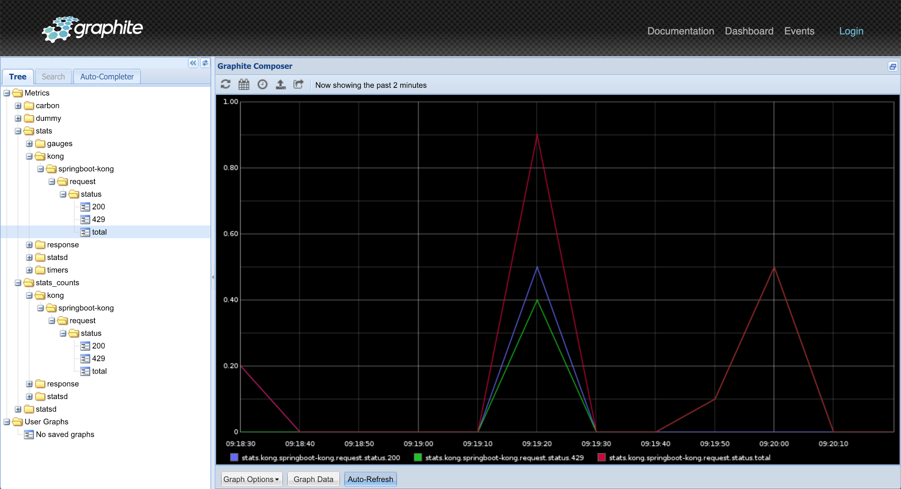

# springboot-kong

## Goal

The goal of this project is to create a simple REST API and securing it with [`Kong`](https://getkong.org) using the
`Basic Authentication` plugin. Besides, we will explore more plugins that Kong offers like: `Rate Limiting` and `StatsD`
plugins.

## Start environment

***Note. In order to run some commands/scripts, you must have [`jq`](https://stedolan.github.io/jq) installed on you
machine***

Run the following script present in `springboot-kong` project root folder.
```
./start-docker-containers
```

## Start `springboot-kong` application

- Open a new terminal.
- Run the following command to start `springboot-kong` application.
```
mvn clean spring-boot:run
```

## KONG

Please, refer to `Kong Admin API` https://getkong.org/docs/0.13.x/admin-api in order to get a complete documentation.

### Pre-configuration

- Open a new terminal where all `Kong` configuration commands will be executed.
- Export your machine ip address to `HOST_IP_ADDR` environment variable.
> It can be obtained by executing ifconfig command on Mac/Linux terminal or ipconfig on Windows;
```
export HOST_IP_ADDR=...
```

- Check if `Kong` it's running
``` 
curl http://localhost:8001
```

### Add Service

- Using `application/x-www-form-urlencoded` content type
```
curl -i -X POST http://localhost:8001/services/ \
  -d "name=springboot-kong" \
  -d "protocol=http" \
  -d "host=${HOST_IP_ADDR}" \
  -d "port=8080"
```

**OR** 

- You can use `application/json` content type. Besides, in order to set `protocol`, `host`, `port` and `path` at once,
the `url` shorthand attribute can be used.
```
curl -i -X POST http://localhost:8001/services/ \
  -H 'Content-Type: application/json' \
  -d '{ "name": "springboot-kong", "url":"http://'${HOST_IP_ADDR}':8080" }'
```

### Add routes

- One route for `/api/public` endpoint
```
curl -i -X POST http://localhost:8001/services/springboot-kong/routes/ \
  -d "protocols[]=http" \
  -d "hosts[]=springboot-kong" \
  -d "paths[]=/api/public" \
  -d "strip_path=false"
```

- Another for `/api/private` endpoint
```
PRIVATE_ROUTE_ID=$(curl -s -X POST http://localhost:8001/services/springboot-kong/routes/ \
  -H 'Content-Type: application/json' \
  -d '{ "protocols": ["http"], "hosts": ["springboot-kong"], "paths": ["/api/private"], "strip_path": false }' | jq -r .id)
```
Here, I am getting the `/api/private` route id. It will be used on the next steps. To see the value type
`echo $PRIVATE_ROUTE_ID`

In order to list all routes, run: `curl -s http://localhost:8001/routes | jq .`

### Call endpoints

- `/api/public` endpoint
```
curl -i http://localhost:8000/api/public -H 'Host: springboot-kong'
```

It should return
```
Code: 200
Response Body: It is public.
```

- `/api/private` endpoint

**PS. this endpoint is not secured by the application, that is why the response is returned. The idea is to use Kong to
secure it. It will be done on the next steps.**
```
curl -i http://localhost:8000/api/private -H 'Host: springboot-kong'
```

It should return
```
Code: 200
Response Body: null, it is private.
```

### Plugins

In this tutorial, we are going to add three plugins: `Basic Authentication`, `Rate Limiting` and `StatsD`.
Please refer to https://konghq.com/plugins for more plugins.

#### Add Basic Authentication plugin

1. Add plugin to `/api/private` endpoint route
```
curl -X POST http://localhost:8001/routes/${PRIVATE_ROUTE_ID}/plugins \
  -d "name=basic-auth" \
  -d "config.hide_credentials=true"
```

2. Try to call `/api/private` endpoint. The `/api/public` must continue working.
```
curl -i http://localhost:8000/api/private -H 'Host: springboot-kong'
```

It should return
```
Code: 401
Response Body: {"message":"Unauthorized"}
```

3. Create a consumer
```
curl -X POST http://localhost:8001/consumers \
  -d "username=user_ivanfranchin"
```

4. Create a credential for consumer
```
curl -X POST http://localhost:8001/consumers/user_ivanfranchin/basic-auth \
  -d "username=ivan.franchin" \
  -d "password=123"
```

5. Call `/api/private` endpoint using `ivan.franchin` credential
```
curl -i -u ivan.franchin:123 http://localhost:8000/api/private -H 'Host: springboot-kong'
```

It should return
```
Code: 200
Response Body: ivan.franchin, it is private.
```

When a client has been authenticated, the plugin will append some headers to the request before proxying it to the
upstream service, like: `X-Consumer-ID`, `X-Consumer-Username` and `X-Credential-Username`. For more information about
those headers, please refer to https://getkong.org/plugins/basic-authentication. You can see those values
using the actuator endpoint `httptrace`: http://localhost:8080/actuator/httptrace.

In the example above, the application controller is using the `X-Credential-Username` header to log `ivan.franchin`.

#### Add Rate Limiting plugin

1. Add plugin to `springboot-kong` service
```
curl -X POST http://localhost:8001/services/springboot-kong/plugins \
  -d "name=rate-limiting"  \
  -d "config.minute=5"
```

2. Make some calls to
```
curl -i -u ivan.franchin:123 http://localhost:8000/api/private -H 'Host: springboot-kong'
```

3. After exceeding 5 calls in a minute, you should see
```
Code: 429 Too Many Requests
Response Body: {"message":"API rate limit exceeded"}
```

#### Add StatsD plugin

1. Add plugin to `springboot-kong` service

**PS. Inform the ip address of your machine in the `config.host` parameter**
```
curl -X POST http://localhost:8001/services/springboot-kong/plugins \
  -d "name=statsd"  \
  -d "config.host=${HOST_IP_ADDR}" \
  -d "config.port=8125"
```

2. Make some requests to `springbook-kong` endpoints

3. Access `Graphite-Statsd` at http://localhost:8081 and check the `kong` statistics.



## TODO

- Add LDAP authentication plugin https://docs.konghq.com/hub/kong-inc/ldap-auth/